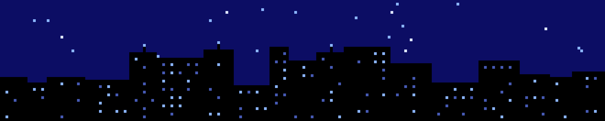
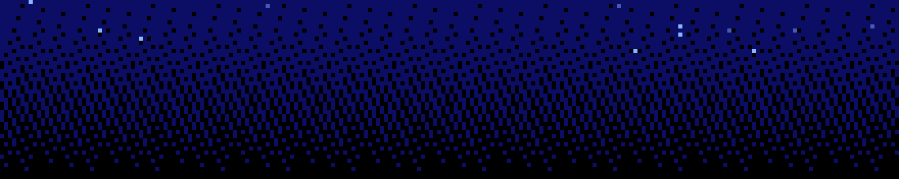

<div align="center">



<p align="center">
  <strong>AI Service Engineer&nbsp;·&nbsp;AX Engineer</strong><br/>
  <code>LLM Agent</code> · <code>RAG</code> · <code>MSA</code> · <code>Computer Vision</code>
</p>

<br/>

<a href="mailto:jkwltx177@gmail.com"></a>
<a href="https://github.com/jkwltx177"></a>
<a href="https://velog.io/@jkwltx177"></a>

</div>

## About Me

> **"측정되지 않는 AI는 배포될 수 없다" — AI의 출력을 검증하는 체계까지 설계하는 엔지니어**

- **LLM Agent · RAG · 멀티에이전트 오케스트레이션**부터 **MSA 백엔드 · K8s/GitOps 배포**까지, AI 서비스를 **End-to-End**로 만듭니다.
- 골든셋 224건 전수 실측(정확도 96.6%), LLM 호출 비용 93% 절감(usage_metadata 계측) — **숫자로 증명하는 개발**을 지향합니다.
- **SK AI Leader Academy(SKALA)** 수료 — AI 서비스 개발 팀 프로젝트 **최우수상(1위)** · 미니 프로젝트 94.8점.
- Art & Technology 전공 — 사용자 경험에서 문제를 발견하고, 기술로 실체화하는 융합형 시각.

```yaml
name:   "김주환 (Juhwan Kim)"
role:   "AI Service Engineer / AX Engineer"
focus:  ["LLM Agent", "Agent Evaluation", "RAG", "MSA", "Computer Vision"]
motto:  "작게 만들고, 측정하고, 반복한다"
```

## Tech Stack

#### AI / ML


#### Backend · Infra


#### Frontend · App


#### Foundation


<br/><sub>C++ — 자료구조·알고리즘 집중 학습</sub>

## Featured Projects

### QApilot — Agentic AI 기반 통합 테스트 자동화 시스템
> **SKALA AI 서비스 개발 팀 프로젝트 최우수상(1위)** · **기술 리드** — 오케스트레이터·Agent 설계·백엔드·테스트 대상 시스템(SUT) 전체 담당 · 6인 팀 · SKT 차세대 시스템(NOVA)을 개발하는 SK AX 현업 조직 발주

코드베이스와 요구사항 문서(PRD·정책·약관)를 읽어 **E2E 테스트 시나리오(TS·TC·TV)를 자동 생성**하고, Playwright로 **UI–API–DB 3-Tier를 교차 검증**하는 Agentic AI 시스템입니다. 장애 시 원인 후보(Top-N)·수정 코드·담당자를 제안하고, 요구사항 추적(RTM)·HITL 승인까지 통합 테스트 전 과정을 자동화합니다.
- 골든셋 **224 TC** 전수 실측 — **요구사항 커버리지 100% · 결함 판정 정확도 96.6% · 테스트 코드 정확도 89.2%**
- 시나리오 생성을 **TS·TC·TV Agent로 분리**해 컨텍스트 폭주·할루시네이션 완화 → **LLM 호출 비용 약 93%↓**($0.21→$0.0144, usage_metadata 실측)
- 실행 불가(SKIPPED)·검증 축 부재(UNVERIFIED)를 분리하는 **판정 분류 체계**로 '확인되지 않은 성공'이 지표를 오염시키지 않게 설계
- `LangGraph` Orchestrator(9 Agent · 8 Tool) · `FastAPI` · `Spring Boot` · `React`+`Vite` · `Playwright` · `tree-sitter`(AST) · `Qdrant` · `BGE-M3` · `Celery`/`Redis` · `PostgreSQL`+`S3`
- 테스트 대상 시스템 **Mini-BSS**(통신 BSS MSA: FastAPI×2 + Vue 3 16화면 + PostgreSQL·MariaDB, 의도적 결함 7종)까지 단독 설계·구현
- **[skala-QApilot](https://github.com/skala-QApilot)** · **[SUT](https://github.com/skala-QApilot/system-under-test)**

### baggin' — 자율 논문 리서치 · 평가 · 보고서 생성 AI Agent
> **SKALA 미니 프로젝트 94.8점** · **팀 내 최다 기여(47/90 커밋)** — 논문 평가 파이프라인(paper-service) 구현 · 챗봇 서비스 단독 개발 · LLM 비용 30% 절감

하루 ~14,000편 쏟아지는 논문을 **자동 수집·평가·한국어 요약**하고 사내 문서와 연결하는 MSA 플랫폼. Sakana.ai *The AI Scientist*의 평가 코드를 직접 분석(리서치 문서 단독 작성)해 서비스 파이프라인으로 이식했습니다.
- **논문 평가(AIRA)**: 데스크 리젝션(gpt-4o-mini) → **Reviewer 3인 앙상블 + Self-Reflection + Area Chair 메타리뷰**(GPT-4o) → 점수 ≥ 5.0만 요약·적재 — 싼 판정→비싼 판정 계층화로 **논문당 API 호출 7회 억제, 비용 약 30% 절감**
- arXiv 수집 → Kafka 이벤트 → 평가 → ChromaDB RAG → 사내 문서 비교 보고서 스트리밍
- `Spring Cloud`(Eureka·Gateway·JWT) · `FastAPI`×5 · `Vue 3` · `Kafka` · `MariaDB` · `ChromaDB` · Docker 12컨테이너
- **[Repository](https://github.com/jkwltx177/baggin)**

### A!rport — 사내 AI 에이전트 스토어
> SKALA 웹 서비스 개발 미니 프로젝트(4인) — AI 에이전트 파이프라인 설계 · RAG 임베딩 · 웹서비스 통합(WebSocket/Kafka) · 워크스페이스 프론트

직원이 카탈로그에서 AI 에이전트를 구독하면 부서 예산으로 **노드 단위 사용량 과금**(Kafka 이벤트 → billing)이 이뤄지는 사내 에이전트 마켓플레이스. 첫 입점 상품으로 투자심사 멀티에이전트를 탑재했습니다.
- **LangGraph 11노드 파이프라인**: Supervisor 라우팅 → 병렬 fan-out 분석(기술·시장·경쟁사) → **LLM-as-Judge 재시도 루프**(실패한 에이전트만 부분 재실행, 최대 3회) → 투자 판정 → PDF 보고서
- FastAPI **WebSocket으로 노드 실행 로그를 실시간 스트리밍**하는 3-Panel 워크스페이스, HITL 체크포인트 5개
- `Spring Cloud` MSA 7서비스(Eureka·Gateway·OAuth2/JWT·Billing) · `Vue 3` · `FAISS`+`BGE-M3` 로컬 RAG(캐시 히트 시 웹검색 생략)
- **[Repository](https://github.com/jkwltx177/airport-agent-store)**

### ECU Quality System (Smart Glass) — 차량 ECU 품질 진단 멀티모달 AI MSA
> **SKALA 미니 프로젝트 발표 평가 2위** · 4인 팀 · **최다 기여(47/95 커밋)** — 초기 아키텍처·API 명세 설계 · AI 파이프라인 통합 · 백엔드 · 배포 인프라

스마트글래스를 쓴 현장 엔지니어의 음성·사진을 **STT(faster-whisper) → Vision(GPT-4V) → 고장확률·잔여수명 예측(LGBM/XGB/TCN) → 정비 매뉴얼 RAG 조치 가이드**로 잇는 차량 ECU 진단 시스템 (OBD 표준 진단코드 DTC 기반).
- 전체 디렉토리 구조·API 명세(A~F)를 초기 설계하고 LangGraph 멀티모달 오케스트레이션·하이브리드 RAG(FAISS 벡터+RDB 유사사례)를 통합 — PR 통합 게이트 역할(머지 9건 중 5건)
- **GitHub Actions CI → Harbor → ArgoCD GitOps → NGINX 카나리(90/10)** 배포를 프로젝트 종료 후 자발적 심화 학습으로 실클러스터에 단독 구축 — PVC multi-attach 등 운영 트러블슈팅 커밋 실증
- `FastAPI` · `Spring Boot`(JWT) · `Vue 3`/`TS` · `FAISS` · `MariaDB` · `K8s`/`ArgoCD`
- **[Repository](https://github.com/jkwltx177/smart-glass-ai-system)**

<details>
<summary><b>More Projects (펼쳐보기)</b></summary>

<br/>

| 프로젝트 | 설명 | 핵심 기술 |
|---|---|---|
| **[Startup-Invest-Agent](https://github.com/jkwltx177/startup-invest-agent)** | 반도체·AI 스타트업 투자심사 멀티에이전트 (4인) — 파이프라인 설계·한국어 RAG(BGE-m3-ko)·**LLM은 척도 추출, 판정은 결정론적 Scorecard/Gate로 분리** | LangGraph · FAISS · pdfplumber |
| **[LGES vs CATL Agent](https://github.com/jkwltx177/lges-vs-catl-analysis)** | 배터리 산업 전략 비교 AI Agent (4인) — 데이터 정제·SWOT 구조화(Refine) 단계 설계, 출처 보존 Structured Output | LangGraph · Chroma · Pydantic |
| **[MOAA](https://github.com/jkwltx177/2025-1-Mobile-computing-MOAA)** | 기프티콘 자동 정리 앱 (4인 **조장**) — **ML Kit 온디바이스 OCR·바코드** 추출 파이프라인·중복 등록 방지 설계, 유저 인터뷰→배포 전 과정 | React Native · ML Kit |
| **[Ræm (raemctrl)](https://github.com/jkwltx177/raemctrl)** | 졸업전시 AI 심리 투사 검사(HTP) 키오스크 — 플로피·프린터·OBS 통합 제어, **3일 400명 무중단 운영** · 캡스톤디자인 경진대회 **장려상** | Python · OpenCV · Socket |
| **[TrendPilot](https://github.com/jkwltx177/trendpilot-kbeauty-agent)** | K뷰티 글로벌 진출 전략 B2B 에이전트 (2인) — 제품 사진 1장 → 규제 RAG·트렌드 분석 → 전략 PDF·광고 에셋 | GPT-4o · DALL·E 3 · ChromaDB |
| **[Artifiction](https://github.com/jkwltx177/artifiction)** | 명화 딥페이크·스타일 트랜스퍼 전시 (캡스톤 I, 3인 팀 개발 담당) — GTX 1660 Ti 단일 노트북에서 스타일 모델 3종 학습·서빙, 품질-시간 트레이드오프 설계 | InsightFace · Fast Style Transfer · Unity |
| **[박쥐피플](https://store.onstove.com/ko/games/4128)** | Unity/C# 게임 — 캐릭터 스위칭·맵·무기 스왑 구현, **스토브 퍼블리싱 완수** | Unity · C# |

</details>

## Research Experience

### 중앙대학교 CISLAB — 학부연구생 (AI · 백엔드) · 2024.10 ~ 2025.10
- **LeNet-5 → ResNet → Vanilla Transformer**를 PyTorch로 밑바닥부터 구현·스크래치 학습 (Multi-GPU 영–한 번역 성능 검증)
- 웹 플랫폼 MVP **백엔드 개발** — `FastAPI` · `SQLAlchemy ORM` · `MySQL`
- 딥러닝 논문 스터디 진행

## Awards & Education & Certifications

**Awards**
- **SKALA AI 서비스 개발 팀 프로젝트 최우수상 (1위)** — SK AX
- **2025 SW·AI 캡스톤디자인 경진대회 장려상** — 중앙대학교 SW교육원

**Education**
- **SK AI Leader Academy (SKALA)** 수료 — SK AX (2026.01 ~ 2026.06)
- **중앙대학교** 예술공학대학 컴퓨터예술학부 (2020.03 ~ 2026.08, 졸업예정)

**Certifications**
- **SQLD** (SQL 개발자) — 한국데이터산업진흥원, 2026.03

## GitHub Stats

<div align="center">


</div>

<div align="center">
<br/>

**작게 만들고, 측정하고, 반복한다.**



</div>
