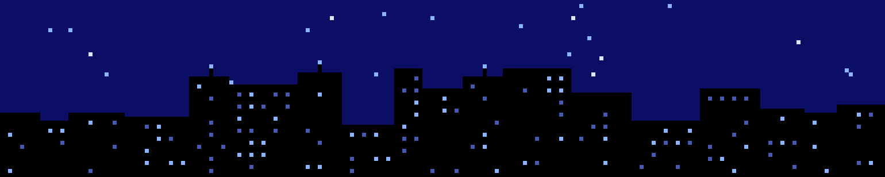
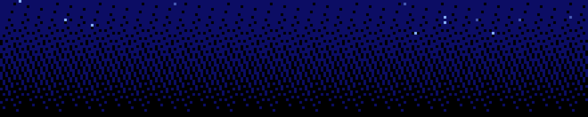

  <strong>AI Service Engineer&nbsp;·&nbsp;AX Engineer</strong> 
  <code>LLM Agent</code> · <code>RAG</code> · <code>MSA</code> · <code>Computer Vision</code>

 

## Tech Stack

#### AI / ML

#### Backend · Infra

#### Frontend · App

#### Foundation

 C++: 자료구조·알고리즘 집중 학습 · OpenGL 3D 렌더링 팀 프로젝트(<a href="https://github.com/jkwltx177/cg-opengl-maze">cg-opengl-maze</a>)

## Featured Projects

### QApilot · Agentic AI 기반 통합 테스트 자동화 시스템

<table>
<tr><td width="118" valign="top"><b>수상 · 역할</b></td><td>SKALA AI 서비스 개발 팀 프로젝트 <b>최우수상(1위)</b> · 6인 팀 <b>기술 리드</b>(오케스트레이터 · Agent 설계 · 백엔드 · 테스트 대상 시스템 전체) · SKT 차세대 시스템(NOVA)을 개발하는 SK AX 현업 조직 발주</td></tr>
<tr><td valign="top"><b>개요</b></td><td>코드베이스와 요구사항 문서(PRD·정책·약관)를 읽어 <b>E2E 테스트 시나리오(TS·TC·TV)를 자동 생성</b>하고, Playwright로 <b>UI-API-DB 3-Tier를 교차 검증</b>하는 Agentic AI 시스템. 장애 시 원인 후보(Top-N)·수정 코드·담당자를 제안하고, 요구사항 추적(RTM)·HITL 승인까지 통합 테스트 전 과정을 자동화</td></tr>
<tr><td valign="top"><b>실측 성과</b></td><td>골든셋 <b>224 TC</b> 전수 실측: 요구사항 커버리지 <b>100%</b> · 결함 판정 정확도 <b>96.6%</b> · 테스트 코드 정확도 <b>89.2%</b> 시나리오 생성을 TS·TC·TV Agent로 분리해 컨텍스트 폭주·할루시네이션 완화 → LLM 호출 비용 약 <b>93%↓</b>($0.21→$0.0144, usage_metadata 실측)</td></tr>
<tr><td valign="top"><b>설계</b></td><td>실행 불가(SKIPPED)·검증 축 부재(UNVERIFIED)를 분리하는 <b>판정 분류 체계</b>를 직접 정의. '확인되지 않은 성공'이 지표를 오염시키지 않게 설계 테스트 대상 시스템 <b>Mini-BSS</b>(통신 BSS MSA: FastAPI×2 + Vue 3 16화면 + PostgreSQL·MariaDB, 의도적 결함 7종)까지 단독 설계·구현</td></tr>
<tr><td valign="top"><b>스택</b></td><td><code>LangGraph</code> Orchestrator(9 Agent · 8 Tool) · <code>FastAPI</code> · <code>Spring Boot</code> · <code>React</code>+<code>Vite</code> · <code>Playwright</code> · <code>tree-sitter</code>(AST) · <code>Qdrant</code> · <code>BGE-M3</code> · <code>Celery</code>/<code>Redis</code> · <code>PostgreSQL</code>+<code>S3</code></td></tr>
<tr><td valign="top"><b>링크</b></td><td><a href="https://github.com/skala-QApilot"><b>skala-QApilot</b></a> · <a href="https://github.com/skala-QApilot/system-under-test"><b>SUT</b></a></td></tr>
</table>

### baggin' · 자율 논문 리서치·평가·보고서 생성 AI Agent

<table>
<tr><td width="118" valign="top"><b>수상 · 역할</b></td><td>SKALA 미니 프로젝트 <b>94.8점</b> · <b>팀 내 최다 기여(47/90 커밋)</b> · 논문 평가 파이프라인(paper-service) 구현 · 챗봇 서비스 단독 개발</td></tr>
<tr><td valign="top"><b>개요</b></td><td>하루 ~14,000편 쏟아지는 논문을 <b>자동 수집·평가·한국어 요약</b>하고 사내 문서와 연결하는 MSA 플랫폼. Sakana.ai <i>The AI Scientist</i>의 평가 코드를 직접 분석(리서치 문서 단독 작성)해 서비스 파이프라인으로 이식</td></tr>
<tr><td valign="top"><b>실측 성과</b></td><td>싼 판정에서 비싼 판정으로 계층화해 논문당 API 호출 <b>7회 억제</b>, LLM 비용 약 <b>30% 절감</b></td></tr>
<tr><td valign="top"><b>설계</b></td><td>논문 평가(AIRA): 데스크 리젝션(gpt-4o-mini) → <b>Reviewer 3인 앙상블 + Self-Reflection + Area Chair 메타리뷰</b>(GPT-4o) → 점수 ≥ 5.0만 요약·적재 arXiv 수집 → Kafka 이벤트 → 평가 → ChromaDB RAG → 사내 문서 비교 보고서 스트리밍</td></tr>
<tr><td valign="top"><b>스택</b></td><td><code>Spring Cloud</code>(Eureka·Gateway·JWT) · <code>FastAPI</code>×5 · <code>Vue 3</code> · <code>Kafka</code> · <code>MariaDB</code> · <code>ChromaDB</code> · Docker 12컨테이너</td></tr>
<tr><td valign="top"><b>링크</b></td><td><a href="https://github.com/jkwltx177/baggin"><b>Repository</b></a></td></tr>
</table>

### A!rport · 사내 AI 에이전트 스토어

<table>
<tr><td width="118" valign="top"><b>역할</b></td><td>SKALA 웹 서비스 개발 미니 프로젝트(4인) · AI 에이전트 파이프라인 설계 · RAG 임베딩 · 웹서비스 통합(WebSocket/Kafka) · 워크스페이스 프론트</td></tr>
<tr><td valign="top"><b>개요</b></td><td>직원이 카탈로그에서 AI 에이전트를 구독하면 부서 예산으로 <b>노드 단위 사용량 과금</b>(Kafka 이벤트 → billing)이 이뤄지는 사내 에이전트 마켓플레이스. 첫 입점 상품으로 투자심사 멀티에이전트를 탑재</td></tr>
<tr><td valign="top"><b>설계</b></td><td><b>LangGraph 11노드 파이프라인</b>: Supervisor 라우팅 → 병렬 fan-out 분석(기술·시장·경쟁사) → <b>LLM-as-Judge 재시도 루프</b>(실패한 에이전트만 부분 재실행, 최대 3회) → 투자 판정 → PDF 보고서 FastAPI <b>WebSocket으로 노드 실행 로그를 실시간 스트리밍</b>하는 3-Panel 워크스페이스, HITL 체크포인트 5개</td></tr>
<tr><td valign="top"><b>스택</b></td><td><code>Spring Cloud</code> MSA 7서비스(Eureka·Gateway·OAuth2/JWT·Billing) · <code>Vue 3</code> · <code>FAISS</code>+<code>BGE-M3</code> 로컬 RAG(캐시 히트 시 웹검색 생략)</td></tr>
<tr><td valign="top"><b>링크</b></td><td><a href="https://github.com/jkwltx177/airport-agent-store"><b>Repository</b></a></td></tr>
</table>

### ECU Quality System (Smart Glass) · 차량 ECU 품질 진단 멀티모달 AI MSA

<table>
<tr><td width="118" valign="top"><b>수상 · 역할</b></td><td>SKALA 미니 프로젝트 <b>발표 평가 2위</b> · 4인 팀 · <b>최다 기여(47/95 커밋)</b> · 초기 아키텍처·API 명세 설계 · AI 파이프라인 통합 · 백엔드 · 배포 인프라</td></tr>
<tr><td valign="top"><b>개요</b></td><td>스마트글래스를 쓴 현장 엔지니어의 음성·사진을 <b>STT(faster-whisper) → Vision(GPT-4V) → 고장확률·잔여수명 예측(LGBM/XGB/TCN) → 정비 매뉴얼 RAG 조치 가이드</b>로 잇는 차량 ECU 진단 시스템 (OBD 표준 진단코드 DTC 기반)</td></tr>
<tr><td valign="top"><b>설계</b></td><td>전체 디렉토리 구조·API 명세(A~F)를 초기 설계하고 LangGraph 멀티모달 오케스트레이션·하이브리드 RAG(FAISS 벡터+RDB 유사사례)를 통합. PR 통합 게이트 역할(머지 9건 중 5건) <b>GitHub Actions CI → Harbor → ArgoCD GitOps → NGINX 카나리(90/10)</b> 배포를 프로젝트 종료 후 자발적 심화 학습으로 실클러스터에 단독 구축. PVC multi-attach 등 운영 트러블슈팅 커밋이 그 기록</td></tr>
<tr><td valign="top"><b>스택</b></td><td><code>FastAPI</code> · <code>Spring Boot</code>(JWT) · <code>Vue 3</code>/<code>TS</code> · <code>FAISS</code> · <code>MariaDB</code> · <code>K8s</code>/<code>ArgoCD</code></td></tr>
<tr><td valign="top"><b>링크</b></td><td><a href="https://github.com/jkwltx177/smart-glass-ai-system"><b>Repository</b></a></td></tr>
</table>

<b>More Projects (펼쳐보기)</b>

 

| 프로젝트 | 설명 | 핵심 기술 |
|---|---|---|
| **[CareerPilot](https://github.com/jkwltx177/careerpilot)** | Claude Code를 **취준 전담 AI 컨설턴트**로 만드는 오픈소스 템플릿 (1인). 채용 전문가 스탠스 · **위키형 파일 메모리**(회사별 status/연대기/규칙 이원화) · **멀티에이전트 워크플로우 5종**(기업 리서치·자소서 적대 검토·코테 복기·기획 검증·공고 스윕) · 로컬 코테 저지 · 관제탑 대시보드. 실제 대기업 지원 캠페인 한 시즌 운영으로 검증 | Claude Code · Multi-Agent Workflow |
| **[Startup-Invest-Agent](https://github.com/jkwltx177/startup-invest-agent)** | 반도체·AI 스타트업 투자심사 멀티에이전트 (4인). 파이프라인 설계·한국어 RAG(BGE-m3-ko)·**LLM은 척도 추출, 판정은 결정론적 Scorecard/Gate로 분리** | LangGraph · FAISS · pdfplumber |
| **[LGES vs CATL Agent](https://github.com/jkwltx177/lges-vs-catl-analysis)** | 배터리 산업 전략 비교 AI Agent (4인). 데이터 정제·SWOT 구조화(Refine) 단계 설계, 출처 보존 Structured Output | LangGraph · Chroma · Pydantic |
| **[MOAA](https://github.com/jkwltx177/2025-1-Mobile-computing-MOAA)** | 기프티콘 자동 정리 앱 (4인 **조장**). **ML Kit 온디바이스 OCR·바코드** 추출 파이프라인·중복 등록 방지 설계, 유저 인터뷰부터 배포까지 전 과정 | React Native · ML Kit |
| **[Ræm (raemctrl)](https://github.com/jkwltx177/raemctrl)** | 졸업전시 AI 심리 투사 검사(HTP) 키오스크. 플로피·프린터·OBS 통합 제어, **전시 3일 449명(로그 실측) 무중단 운영** · 캡스톤디자인 경진대회 **장려상** | Python · Pygame · OBS WebSocket |
| **[TrendPilot](https://github.com/jkwltx177/trendpilot-kbeauty-agent)** | K뷰티 글로벌 진출 전략 B2B 에이전트 (2인 · RAG 실습 팀 평가 2위). 제품 사진 1장 → 규제 RAG·트렌드 분석 → 전략 PDF·광고 에셋 | GPT-4o · DALL·E 3 · ChromaDB |
| **[Artifiction](https://github.com/jkwltx177/artifiction)** | 명화 딥페이크·스타일 트랜스퍼 전시 (캡스톤 I, 3인 팀 개발 담당). GTX 1660 Ti 단일 노트북에서 스타일 모델 3종 학습·서빙, 품질과 시간의 트레이드오프 설계 | InsightFace · Fast Style Transfer · Unity |
| **[cg-opengl-maze](https://github.com/jkwltx177/cg-opengl-maze)** | C++/OpenGL 고정 파이프라인 **1인칭 3D 미로 게임 + SOR 모델러** (4인). 카메라·맵·**AABB 충돌 처리** 담당, LOD·텍스처 맵핑·스카이박스 직접 구현 | C++ · OpenGL(GLUT) |
| **[박쥐피플](https://store.onstove.com/ko/games/4128)** | Unity/C# 게임. 캐릭터 스위칭·맵·무기 스왑 구현, **스토브 퍼블리싱 완수** | Unity · C# |

## Research Experience

### 중앙대학교 CISLAB · 학부연구생 (AI·백엔드) · 2024.10 ~ 2025.10

<table>
<tr><td width="118" valign="top"><b>논문 구현</b></td><td><b>LeNet-5 → ResNet → Vanilla Transformer</b>를 PyTorch로 밑바닥부터 구현·스크래치 학습 (Multi-GPU 영한 번역 성능 검증)</td></tr>
<tr><td valign="top"><b>백엔드</b></td><td>웹 플랫폼 MVP 백엔드 개발: <code>FastAPI</code> · <code>SQLAlchemy ORM</code> · <code>MySQL</code></td></tr>
<tr><td valign="top"><b>스터디</b></td><td>딥러닝 논문 스터디 진행</td></tr>
</table>

## Awards & Education & Certifications

<table>
<tr><td width="118" valign="top"><b>Awards</b></td><td><b>SKALA AI 서비스 개발 팀 프로젝트 최우수상 (1위)</b> · SK AX <b>2025 SW·AI 캡스톤디자인 경진대회 장려상</b> · 중앙대학교 SW교육원</td></tr>
<tr><td valign="top"><b>Education</b></td><td><b>SK AI Leader Academy (SKALA)</b> 수료 · SK AX (2026.01 ~ 2026.06) <b>중앙대학교</b> 예술공학대학 컴퓨터예술학부 졸업 (2020.03 ~ 2026.08)</td></tr>
<tr><td valign="top"><b>Certifications</b></td><td><b>SQLD</b> (SQL 개발자) · 한국데이터산업진흥원, 2026.03</td></tr>
</table>

## GitHub Stats

 

